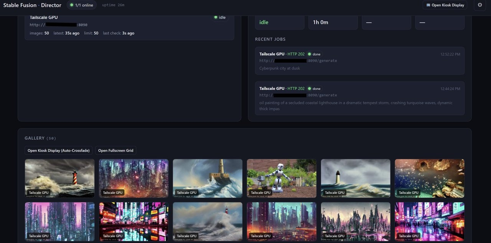

# Stable Fusion Art

An autonomous AI art generation system. A GPU server generates images with
Stable Diffusion 1.5 on a schedule, a director orchestrates one or more servers,
and the results are shown in a browser gallery and a fullscreen wall-display
kiosk.

**By [ViVSoft Computers LLC](https://www.vivsoft.live) · [LoRa Mesh Devices](https://hub.lorameshdevices.com/)** · MIT License



```
                    ┌─────────────────────────────────────────────┐
                    │                director.py                   │
                    │  (port 8091) — scheduler + orchestrator      │
                    │                                              │
                    │  • fires generation on a timer                │
                    │  • health-polls servers, routes to idle ones │
                    │  • aggregates galleries from every server    │
                    │  • serves the dashboard + the kiosk          │
                    └───────────────┬──────────────────────────────┘
                                    │  HTTP (JSON API)
                    ┌───────────────▼──────────────────────────────┐
                    │                art_server.py                  │
                    │  (port 8090) — the generation engine          │
                    │                                              │
                    │  • async job queue, serialized GPU generation │
                    │  • spawns art_generator.py (SD 1.5)          │
                    │  • serves the static gallery + image files   │
                    │  • optional token auth, retention pruning    │
                    └──────────────────────────────────────────────┘
```

## What it does

- **Autonomous generation** — the director picks a random prompt from a pool
  and fires a job on an idle server every N minutes (configurable, with jitter).
- **Decoupled server / director** — servers are interchangeable peers that only
  speak a small JSON API. The director load-balances across any number of them.
- **Browser gallery** — the server serves a static viewer (`gallery.html`) plus
  the images themselves.
- **Fullscreen wall-display kiosk** — the director serves `/display`, a
  fullscreen page that auto-refreshes to the newest image with a crossfade.
- **Management dashboard** — the director serves a live dashboard: server
  health, scheduler status, aggregated gallery, and a config drawer.

## Architecture

| Component | Port | Role |
|-----------|------|------|
| `art_server.py` | 8090 | Generation engine. Runs on the GPU machine. |
| `art_generator.py` | — | SD 1.5 pipeline, spawned as a subprocess per job. |
| `director.py` | 8091 | Orchestrator. Schedules work, aggregates galleries, serves UI. |
| `director.html` | — | The management dashboard (served by the director). |
| `display.html` | — | The fullscreen kiosk page (served by the director). |
| `gallery.html` | — | Static gallery viewer (served by the server). |
| `convert_to_raw.py` | — | Converts a PNG to raw RGB565 for the wall panel. |
| `gallery_watchdog.py` | — | Restarts the server if port 8090 goes down. |

### Server (`art_server.py`)

- Async generation: a single worker pops jobs from a queue and runs them one at
  a time (SD 1.5 holds the GPU, so serializing is correct).
- Each job spawns `art_generator.py --one '<json>'` in a subprocess so the model
  load never contends with other GPU processes (e.g. a local LLM).
- Serves the static gallery (`gallery.html`, images, `index.json`).
- Optional token auth on API endpoints (`auth_token` in config).
- **Retention pruning** — `max_images_kept` caps the gallery size; old PNGs are
  pruned and `index.json` is kept in sync after every generation.

### Director (`director.py`)

- Owns the schedule: fires `POST /generate` on an idle server on a configurable
  interval. The server's own local cron is disabled in favor of this.
- Polls `GET /health` on every server, tracks busy/queue/gallery, and routes
  work to the first idle server.
- Aggregates `GET /images` from all servers into one gallery.
- Serves the dashboard (`/`) and the kiosk (`/display`).

## Endpoints

### Server API (`art_server.py`, port 8090)

Full contract in [`API.md`](API.md). Summary:

| Method | Path | Purpose |
|--------|------|---------|
| GET | `/` | `gallery.html` viewer |
| GET | `/<file>` | any image/file in the gallery |
| GET | `/images` | gallery metadata, newest first |
| GET | `/index.json` | metadata, newline-delimited JSON |
| GET | `/health` | `status`, `busy`, `queue_depth`, `gallery_count`, `max_images_kept` |
| GET | `/config` | generation settings |
| PUT | `/config` | merge-update settings |
| POST | `/generate` | submit a job → `{ "job_id": "..." }` |
| GET | `/jobs` | all jobs |
| GET | `/jobs/<id>` | one job (status, image, error) |

### Director API (`director.py`, port 8091)

| Method | Path | Purpose |
|--------|------|---------|
| GET | `/` | the dashboard (`director.html`) |
| GET | `/display` | fullscreen kiosk (`display.html`) |
| GET | `/api/director/health` | director's own health |
| GET | `/api/director/state` | full state (servers, scheduler, gallery) |
| GET | `/api/director/config` | current director config |
| PUT | `/api/director/config` | merge-update director config |
| POST | `/api/director/trigger` | fire one generation now |
| GET | `/api/director/latest` | freshest image URL (for the kiosk) |

## Features

### Dashboard (`director.html`)

- Live server health (status pill, queue depth, gallery count, latency)
- Scheduler status + "Fire now" trigger
- Aggregated gallery with **client-side thumbnail caching** (canvas 320px) and
  `IntersectionObserver` lazy-loading for progressive grid load
- Lightbox viewer with **full-resolution download** button + filename badge
- Per-tile quick-download buttons
- Settings drawer: add/remove servers, edit generation params, prompt pool,
  **per-server retention limit** (`max_images_kept`), auth token

### Wall-display kiosk (`display.html`)

- Fullscreen, auto-refreshes the newest image every 20s
- Two stacked `` layers crossfade so swaps never flash white
- **Fill (cover) vs. letterbox (contain)** toggle — click/tap, or press `M`
- **HTML5 Fullscreen API** — button, double-click, or press `F`
- Cursor auto-hides after 2.5s of inactivity; wakes polling on tab focus

## Configuration

### `director_config.json`

```json
{
  "director": { "host": "0.0.0.0", "port": 8091 },
  "servers": [ { "name": "...", "base_url": "http://...:8090", "auth_token": "" } ],
  "scheduler": { "enabled": true, "interval_seconds": 1800, "jitter_seconds": 60 },
  "generation": { "prompt_pool": [ "..." ], "params": { "steps": 20 } },
  "poll": { "health_interval_seconds": 10, "gallery_interval_seconds": 30 }
}
```

### `server_config.json` (gitignored)

```json
{
  "name": "my-gpu",
  "steps": 20,
  "guidance_scale": 7.5,
  "width": 768,
  "height": 448,
  "auth_token": "",
  "max_images_kept": 50
}
```

`server_config.json` is **not committed** — it holds machine-specific settings
(and possibly a token), so it's excluded via `.gitignore`.

## Running it

Both processes are Python standard-library only — **no `pip install` needed**
for the server/director themselves. The only external dependency is the SD
pipeline environment used by `art_generator.py` (torch + diffusers, pinned).

```bash
# 1. start the server (GPU machine)
python art_server.py

# 2. start the director (anywhere reachable over HTTP)
python director.py
```

> **Note:** `art_server.py` and `art_generator.py` hardcode the path to the
> Python interpreter that has torch/diffusers installed (`ART_PYTHON` env var,
> defaulting to a Windows `Python312` path). Change `ART_PYTHON` (or the
> `PYTHON` constant in `art_generator.py`) to point at your own environment.

Environment variables:

| Variable | Default | Meaning |
|----------|---------|---------|
| `HERMES_GALLERY` | `~/.hermes/gallery` | gallery directory |
| `ART_PYTHON` | *(hardcoded Python312 path)* | Python with torch/diffusers |
| `ART_HOST` / `ART_PORT` | `0.0.0.0` / `8090` | server bind address |
| `ART_PORT` | — | server port |

## Dependencies

- **Server + director**: Python stdlib only.
- **Generation** (`art_generator.py`): Stable Diffusion 1.5 via
  `torch` + `diffusers` + `transformers`, running under a pinned Python
  environment (see below).
- **Optional**: `convert_to_raw.py` needs Pillow if you use the raw RGB565
  output for an embedded wall panel.

## Setting up the SD 1.5 environment

The server and director are pure stdlib, but **generation needs a dedicated
Python environment with a CUDA build of PyTorch + Diffusers**. This is the one
part of the project that is genuinely version-sensitive — the versions below
are pinned for a reason and should not be casually upgraded.

### 1. Create a dedicated Python 3.12 venv

Use a standalone Python 3.12 (not a shared/system install) so nothing else
can disturb it:

```bash
python3.12 -m venv sd-env
# Windows activate:
sd-env\Scripts\activate
# macOS/Linux:
# source sd-env/bin/activate
```

### 2. Install the pinned packages (CUDA build)

PyTorch's default wheel is CPU-only. The GPU build comes from a **separate
index**, and the exact versions matter — a mismatched `torch`/`diffusers` pair
breaks at import or at inference:

```bash
pip install torch==2.6.0 torchvision==0.21.0 \
    --index-url https://download.pytorch.org/whl/cu124
pip install diffusers==0.31.0 transformers==4.47.0
pip install pillow
```

> **Why pinned:** `diffusers 0.31.0` has the `StableDiffusionPipeline` API the
> generator is written against. Newer Diffusers releases changed the pipeline
> interface, so a casual `pip install -U` will produce cryptic errors. `torch
> 2.6.0+cu124` is matched to the `cu124` index; other CUDA versions won't find
> a compatible wheel. These four packages (`torch`, `torchvision`, `diffusers`,
> `transformers`) are a locked set.

### 3. Point the server at this Python

`art_server.py` reads the `ART_PYTHON` environment variable (or a hardcoded
default) to pick the interpreter it spawns for generation. Set it to the venv
you just made:

```bash
# Windows
set ART_PYTHON=C:\path\to\sd-env\Scripts\python.exe
# macOS/Linux
export ART_PYTHON=/path/to/sd-env/bin/python
```

If you don't set it, edit the `PYTHON` constant at the top of `art_server.py`
and `art_generator.py` to point at your interpreter.

### 4. Model weights

The generator loads `sd-legacy/stable-diffusion-v1-5` via Diffusers. On the
first run it downloads ~4GB into the Hugging Face cache
(`~/.cache/huggingface/`).

> **Windows gotcha:** Hugging Face downloads frequently **hang** on Windows.
> If a first-run download stalls, don't retry in a loop — fetch the missing
> individual files with `curl` from
> `https://huggingface.co/sd-legacy/stable-diffusion-v1-5/resolve/main/<file>`
> and place them in the cache directory. The model needs `model_index.json`,
> the `unet/`, `vae/`, `text_encoder/`, `tokenizer/`, and `scheduler/` folders,
> plus the safetensors weights.

### 5. Verify

```bash
python -c "import torch; print('cuda', torch.cuda.is_available())"
```

`True` means the environment is ready. Then start `art_server.py` with
`ART_PYTHON` set and submit a test job — a ~3s image on an RTX 3060 confirms
the whole chain works.

## License

[MIT](LICENSE) © 2026 ViVSoft Computers LLC
